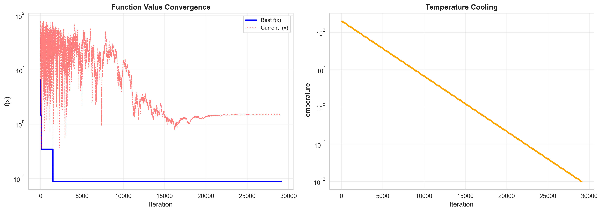

## Hướng dẫn Cài đặt và Chạy chương trình

### Yêu cầu
- Python 3.12
- `pip` và `venv` hoặc `conda`

### Các bước Cài đặt

1.  **Tải source code:**
    ```bash
    git clone https://github.com/trhgbao/CSAI.git
    cd CSAI
    ```
2. **Test cases:**
   Các testcase lưu trong mục `data` dưới dạng file `.txt`. Nếu bạn thêm testcase mới đảm bảo testcase của bạn đúng định dạng và 1-based:
   ```bash
   vertices edges
   1 2
   1 3
   ```
4.  **Cài đặt các Thư viện cần thiết:**
    #### Cách 1: venv
    Nếu bạn dùng venv, nhóm cung cấp sẵn folder `venv` (!Lưu ý: môi trường này dùng Python 3.12). Tuy nhiên, nếu bạn muốn tạo lại môi trường mới thì hãy xóa thư mục `venv` cũ trước rồi thực hiện các bước sau:
    ```bash
    python3 -m venv venv
    pip install -r requirements.txt
    # Trên Windows:
    .\venv\bin\activate
    # Trên macOS/Linux:
    # source venv/bin/activate
    ```
    #### Cách 2: conda
    ```bash
    conda create -n csai python==3.12 -y
    conda activate csai
    pip install -r requirements.txt
    ```

### Graph Coloring 
#### 1. Config 
Các file config (biến và testcase graph_file) của các thuật toán nằm trong folder tương ứng `config/gc/`
#### 2. Hướng dẫn chạy
Điều chỉnh `config/gc/<aco>.yaml`
```bash
python3 gc.py --algo <algo>
```
#### 3. Ví dụ
Để chạy thuật toán Annealing cho bài toán Graph Coloring: Cần điều chỉnh `config/gc/annealing.yaml`.
```bash
python3 gc.py --algo annealing
```
Demo


### Sphere Function
#### 1. Config 
Các file config (biến và testcase dim) của các thuật toán nằm trong folder tương ứng `config/sphere/`
#### 2. Hướng dẫn chạy
Điều chỉnh `config/sphere/<aco>.yaml`
```bash
python3 sphere.py --algo <algo>
```
#### 3. Ví dụ
Để chạy thuật toán Particle Swarm Optimization cho bài toán Sphere Function: Cần điều chỉnh `config/sphere/pso.yaml`.
```bash
python3 sphere.py --algo pso
```
Với dim = 3 của PSO, có hỗ trợ visualize hội tụ trên hệ tọa độ Oxyz. 

